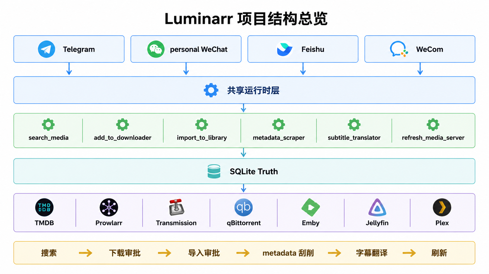

# Luminarr (v71)

Luminarr 是一个面向 **2–4 人自托管影视场景** 的垂直自动化 Harness，目标是把“找片、下片、入库、刷新媒体库”收成一条可控的私聊自动化链路。

它现在已经不是“边做边试”的概念稿，而是一个边界明确、首版承诺范围已冻结的项目。代码里已实现 Telegram / personal WeChat / Feishu / WeCom 四个私聊入口，以及 Transmission / qBittorrent、Emby / Jellyfin / Plex 等路径；但当前**保守首版发布承诺矩阵**只冻结为 `Telegram 私聊 + PT Transmission + Emby + movie-first 主链`。它**不是**通用 AI 助手、通用 Agent 平台或通用多渠道平台。

## 1. 项目定位

- 面向单机、单进程、单实例的自托管影视自动化
- 用一套 shared runtime、approval、`jobs` 和 SQLite 真相承接四个私聊入口
- 主链聚焦 movie-first：搜索、下载审批、确认投递、状态查询、导入审批、硬链接导入、metadata、字幕翻译、媒体库刷新
- BT 支线继续保留：PT / BT 分流、processing-path inquiry、TMDB 关联、`raw_bt` 目录选择、BT 搜索与最小订阅基线
- 下载器支持 Transmission + qBittorrent；刷新支持 Emby / Jellyfin / Plex（按配置选择 provider）

## 2. 当前稳定范围

- 当前首版承诺矩阵：Telegram 私聊 + PT Transmission + Emby + movie-first 主链
- 当前保守版发布准备、搜索 helper 收口和 import worth-it 复评估都已完成；当前默认分支正在做**历史 docs 归档减法**，把已完成主线台账从 `docs/` 主目录移到 `archive/docs/`，继续推进前先按 `docs/NEXT_STEP.md` 确认当前是不是仍在入口/归档收口，而不是误回旧热点代码
- 当前仓库质量入口保持可复验：`make quality`、`make verify-mainline`、`make verify-quality-gates`
- 已实现但当前不纳入首版发布保证的路径，继续保留在代码和测试里，不因为发布口径收紧而回退

## 3. 一眼看懂

如果你想先快速理解这个项目，而不是先读一堆文档，先看这两张图：




更细一点的专项图：

- [搜索与下载审批流程](docs/assets/luminarr-detail-search-download-flow.png)
- [导入审批与媒体识别](docs/assets/luminarr-detail-import-approval-flow.png)
- [导入后处理流程](docs/assets/luminarr-detail-post-import-pipeline.png)
- [字幕翻译细节流程](docs/assets/luminarr-detail-subtitle-translation.png)
- [四渠道如何进入 shared runtime](docs/assets/luminarr-detail-shared-runtime-routing.png)
- [任务状态与确认生命周期](docs/assets/luminarr-detail-task-lifecycle.png)

如果你想看单个渠道里的消息细节图：

- [Telegram 消息卡片图](docs/assets/luminarr-card-telegram.png)
- [personal WeChat 消息卡片图](docs/assets/luminarr-card-personal-wechat.png)
- [Feishu 消息卡片图](docs/assets/luminarr-card-feishu.png)
- [WeCom 消息卡片图](docs/assets/luminarr-card-wecom.png)

## 4. 快速开始

- 想直接把项目跑起来：看 `docs/GETTING_STARTED.md`
- 不会代码，只想知道先做什么：看 `docs/HUMAN_START_HERE.md`
- 想让 AI 按仓库约定接手：看 `docs/OPERATOR_RUNBOOK.md`
- 想理解“谁收消息、谁写库、谁调外部系统”：看 `docs/ARCHITECTURE.md`

## 5. 当前状态

- 当前短快照和环境真相：看 `docs/STATUS.md`
- 当前主线状态与下一步边界：看 `docs/NEXT_STEP.md`
- 已定死的长期边界：看 `docs/DECISIONS.md`
- 文档总入口和分流规则：看 `docs/INDEX.md`
- 已完成主线的历史台账：看 `archive/docs/`

## 6. 如果你准备继续改

默认还是直接从 `docs/OPERATOR_RUNBOOK.md` 复制模板，不要自己重新发明长提示词。

如果你只想记住一条推进顺序，就记这个：

1. 先看 `docs/STATUS.md`，确认当前是不是绿灯、当前主线是否已经完成，是否需要先做冷启动一致性检查
2. 最快时，直接复制 `docs/STATUS.md` 末尾的 `Recommended Next Operator Command`
3. 如果那一句不适合你当前场景，再去 `docs/OPERATOR_RUNBOOK.md` 按场景复制一条模板
4. 不确定有没有文档漂移时，先用“只做冷启动一致性检查”，不要直接让 AI 动代码

```text
按 AGENTS.md + docs/OPERATOR_RUNBOOK.md 的“默认 3 轮施工”执行。
```

只有当文档真相、真实 smoke、质量入口再次漂移，或你已经明确要切新的主线时，才需要回到 `docs/OPERATOR_RUNBOOK.md` 重新选模板。

## 7. 文档入口

- `docs/HUMAN_START_HERE.md`：非技术操作者总入口
- `docs/OPERATOR_RUNBOOK.md`：可直接复制给 AI 的短模板
- `docs/INDEX.md`：按身份分流的文档地图
- `docs/GETTING_STARTED.md`：安装、启动、最小 smoke
- `docs/ARCHITECTURE.md`：系统结构说明
- `docs/STATUS.md`：当前短快照
- `docs/NEXT_STEP.md`：当前主线状态与下一步边界
- `docs/DECISIONS.md`：长期边界
