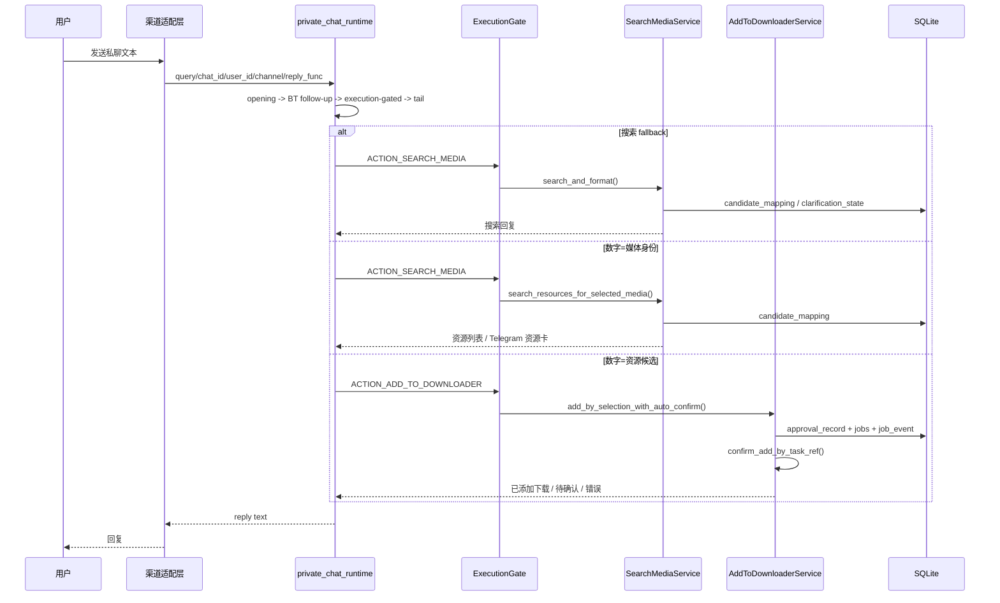

# Private Chat Mainline

> 主要依据：`app/bot/private_chat_runtime.py`、`app/bot/telegram_runtime_adapter.py`、`app/bot/feishu_adapter.py`、`app/bot/personal_wechat_text.py`、`app/bot/wecom_adapter.py`、`app/services/search_media.py`

## 1. 四个渠道如何汇聚成同一条链

四个私聊入口最终都把外部事件投影成同一组字段：

- `query`
- `chat_id`
- `user_id`
- `channel`
- `reply_func`
- `bot_data`

然后统一调用：

`handle_private_chat_query_text(...)`

渠道侧只负责：

- 解析原始平台事件
- 投影内部 chat/user identity
- 记录 channel contact
- 包装对应渠道的 reply 函数

业务路由不在渠道适配层分叉。

## 2. shared runtime 的固定路由顺序

`app/bot/private_chat_runtime.py` 的顺序是当前最重要的真实行为边界：

### 2.1 opening routes

按顺序尝试：

1. frustration / cancel
2. direct BT intent
3. personal WeChat login
4. BT 只读搜索
5. BT 批量确认
6. adult duplicate override

### 2.2 BT follow-up routes

只有当前 chat 有对应 pending state 时才会进入：

1. BT processing path follow-up
2. BT classification follow-up

### 2.3 execution-gated shared routes

统一经过 `ExecutionGate`：

1. `status`
2. `watchlist`
3. `btsub`
4. `import`
5. `cleanup`

### 2.4 tail routes

1. `confirm`
2. BT TMDB association
3. raw BT destination
4. 数字选片 / 选资源
5. 搜索 fallback

这个顺序意味着：

- `confirm` 优先于数字选片
- BT follow-up 优先于正常搜索
- 搜索只在所有显式命令都没命中时才兜底

## 3. 搜索主链

当 query 落到搜索 fallback 时：

1. runtime 先检查当前 chat 是否卡在 BT follow-up 中
2. 没卡住才调用 `search_with_reactive_recovery(...)`
3. 该 wrapper 最终会调 `SearchMediaService.search_and_format(...)`

### 3.1 `SearchMediaService.search_and_format()` 的两段式逻辑

#### A. 先判断是否要先确认媒体身份

它会先构造 `search_request_context`，整合：

- 用户 query 解析
- Prowlarr 搜索结果
- TMDB movie / candidates
- 当前渠道允许展示的确认候选数

如果 TMDB 候选需要先确认：

- 生成 media candidates
- 写入 `candidate_mapping`
- 清除旧 `clarification_state`
- 返回“先选作品”的回复

这时数字并不是“选资源”，而是“选媒体身份”。

#### B. 否则直接给资源候选

如果媒体身份已经足够确定：

- 对 BT 资源做排序和去重
- 把候选写入 `candidate_mapping`
- 如果没有候选，写入 `clarification_state`
- 返回资源列表

## 4. 数字选择不是单一行为

`handle_digit_selection_query()` 会先判断当前缓存里存的是哪类候选。

### 情况 A：数字对应的是“媒体身份候选”

调用 `search_resources_for_selected_media()`：

1. 读出 media identity
2. 按标题 / 原始标题 / 年份重新搜资源
3. 再次排序去重
4. 把新的资源候选写回 `candidate_mapping`
5. Telegram 渠道会优先生成 PT 资源卡 session
6. 其他渠道返回普通资源列表

### 情况 B：数字对应的是“资源候选”

调用 `AddToDownloaderService.add_by_selection_with_auto_confirm()`：

1. 从 `candidate_mapping` 构造 `PendingAddContext`
2. 创建下载审批与 pending job
3. 立刻在同一轮自动执行一次 confirm

这是真实代码里的一个重要细节：

- **选资源时通常不再要求用户额外手打 `confirm`**
- `confirm` 主要服务 direct source、BT follow-up、copy-fallback、显式审批恢复等场景

## 5. `confirm` 如何决定确认什么

`handle_confirm_query()` 的优先级是：

1. 先从 `jobs` 表按 `chat_id + task_ref` 找匹配 job
2. 如果 `workflow_type == add_to_downloader` -> 走下载 confirm
3. 如果 `workflow_type == import_to_library` -> 走导入 confirm
4. 如果持久化 job 没找到，再退回进程内 pending add 判断
5. 最后兜底到 import confirm

因此 `confirm` 不是纯文本分支，而是**持久化任务真相驱动**。

## 6. Telegram 的特殊展示层

Telegram 入口比其他渠道多两层 UI 特化：

- `build_telegram_reply_func(...)`
- PT 资源卡 callback 处理

因此 Telegram 在主链上可能看到：

- poster-card / media-card
- live progress card
- completion summary

但这些只影响展示，不改变共享业务真相。

## 7. 主链时序图

## 8. 这条主链里的关键状态

- `candidate_mapping`：当前 chat 的候选序号真相
- `clarification_state`：当前 chat 是否处于歧义待澄清
- `jobs`：当前 `confirm` 应该落到哪个 workflow
- `approval_record`：该动作是不是 still pending / stale / expired

只看回复文本无法判断完整状态，必须结合这些表。
