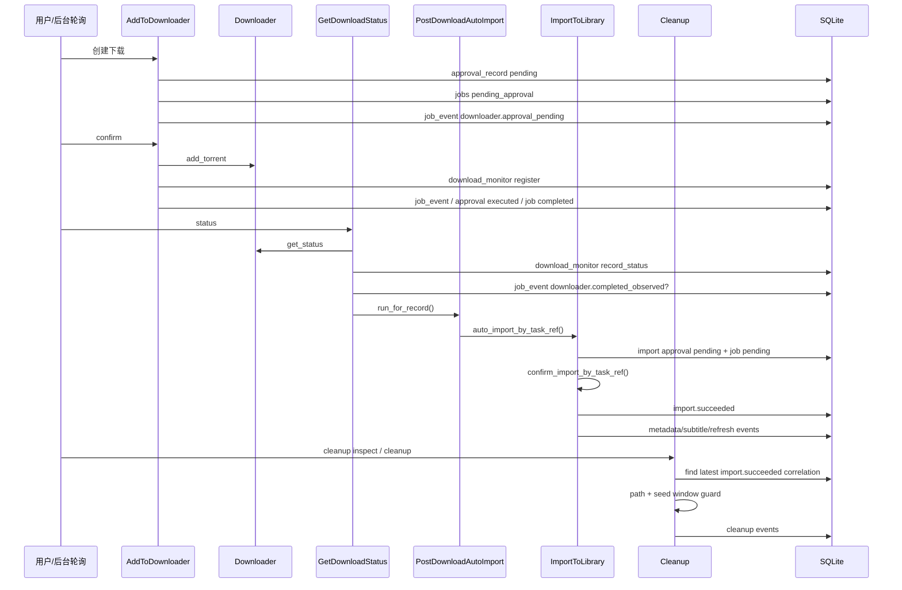

# Download, Import, Status, Cleanup

> 主要依据：`app/services/add_to_downloader.py`、`app/services/add_pending_context.py`、`app/services/get_download_status.py`、`app/services/post_download_auto_import.py`、`app/services/import_to_library.py`、`app/services/import_transfer_execution.py`、`app/services/import_post_processing.py`、`app/services/cleanup_downloaded_source.py`

## 1. 下载审批链

### 1.1 所有下载先落成 `PendingAddContext`

无论来源是：

- 资源候选数字
- direct magnet
- BT follow-up
- `btsub` 命中

最终都会被 `AddPendingContextBuilder` 归一化成：

- `task_ref`
- `task_id`
- `task_hash`
- `title`
- `source`
- `media_identity`
- adult 元信息
- `downloader_name` / `downloader_type` / `download_dir`
- `auto_import_enabled`

### 1.2 持久化顺序

`_persist_pending_add()` 的顺序是：

1. 可选执行 adult duplicate memory 检查
2. `approval_record` 写 `pending`
3. 进程内 pending state 记录
4. `jobs` 写 `pending_approval`
5. `job_event` 写 `downloader.approval_pending`
6. 回复待确认文本

如果中途写 `jobs` 失败，会反向取消前一步 approval，避免留下半套真相。

### 1.3 真正 confirm 时做什么

`confirm_add_by_task_ref()` 不直接调下载器，它会先：

1. 重建 confirm context
2. 校验 job 仍是 `pending_approval`
3. 校验 approval 仍是 `pending`
4. 校验是否过期 / stale
5. claim job lease
6. 把 approval 从 `pending` 转成 `approved`
7. 才执行 `add_torrent`

执行成功后还会继续：

- 写 `job_event`
- 注册 `download_monitor`
- 把 approval 标记 executed
- 把 job 标记 completed

## 2. 状态查询链

`status <任务ID或Hash>` 会调用 `GetDownloadStatusService.get_status_text()`：

1. 用 downloader routing 查询真实下载器状态
2. 把观察结果写回 `download_monitor`
3. 首次观察到完成时写 `downloader.completed_observed`
4. 立即尝试执行自动导入 follow-up
5. 结合事件流水组装回复

### Telegram 特化

如果 channel 是 `telegram_live_progress`：

- 返回 live progress card 文本
- 同时从 `job_event` 推断当前后处理阶段
- 完成后可触发最终 summary

## 3. 自动导入链

`PostDownloadAutoImportService.run_for_record()` 的决策顺序是：

1. 不是 completed -> 跳过
2. `chat_id` 非法 -> 状态不可用
3. 如果该任务在 `adult_content_registry` 里 -> 转成人归档支线
4. 如果已有 terminal import activity -> 跳过
5. 命中低质量规则（CAM/TS 等） -> 写 `auto_import.skipped_by_rule`
6. 否则调用 `ImportToLibraryService.auto_import_by_task_ref()`

所以自动导入不是单纯“下载完成就导入”，而是先过：

- 成人分流
- terminal 幂等检查
- 低质量阻断

## 4. 导入链

### 4.1 用户入口真实行为

runtime 对 `import <ref>` 调的不是 `import_by_task_ref()`，而是：

`auto_import_by_task_ref()`

也就是：

1. 先创建导入待确认
2. 如果 pending state 正常存在，立即自动执行一次 confirm

因此用户手打一条 `import` 时，通常会直接走完首次硬链接导入尝试。

### 4.2 导入前检查

`ImportToLibraryService.import_by_task_ref()` 会先做：

1. 校验 task_ref
2. 判定该任务是不是 `raw_bt`
3. 准备导入源信息
4. 检查下载是否已完成
5. 计算目标路径
6. 创建导入 pending approval + pending job

如果是 `raw_bt`，会直接 fail-closed，不进入媒体入库链。

### 4.3 confirm 导入时的执行模式

第一次 confirm 默认是 `hardlink`：

- 文件 -> 建硬链接
- 目录 -> 递归硬链接
- 外挂字幕 sidecar 也会一并转移

如果命中跨文件系统 `EXDEV`：

- 不会静默改复制
- 会写 `import.copy_fallback_pending`
- 要求用户再次发送 `confirm <ref>`

第二次 confirm 才会改走 `copy`。

### 4.4 后处理链

导入成功后 `ImportPostProcessingService.run()` 固定串起：

1. metadata scraping
2. subtitle translation
3. media server refresh

并分别写事件：

- `metadata.succeeded` / `metadata.failed`
- `subtitle.succeeded` / `subtitle.failed` / `subtitle.skipped`
- `refresh.succeeded` / `refresh.failed`

这些失败不会回滚 `import.succeeded`。

## 5. Cleanup 链

`cleanup inspect <ref>` 和 `cleanup <ref>` 都先执行 `_inspect_cleanup()`：

1. 从 `job_event` 找最近一次 `import.succeeded`
2. 解析 source / target correlation
3. 检查 source 是否还存在
4. 检查 target 是否还存在
5. 检查路径 guardrail
6. 如是 PT 主链，再检查最小做种窗口

### `cleanup inspect`

- 只输出 inspection 结果
- 不删除任何文件

### `cleanup`

如果 inspection 没被 block：

1. 删除 source file / directory
2. 写 cleanup event
3. 返回成功文本

因此 cleanup 依赖的是“最近一次导入成功事件真相”，不是用户自己提供的路径。

## 6. 这条链上的关键自动化点

- 资源数字选择通常会自动 confirm 下载
- `status` 会顺手推进 `download_monitor` 和 auto-import
- `import` 会自动触发首次 confirm
- 只有 copy-fallback 会强制第二次 confirm
- cleanup 永远先 inspect 真实关联

## 7. 主链时序图

## 8. 真实代码里的几个关键边界

- 下载和导入都同时使用 `approval_record` + `jobs` 双轨保护
- `job_event` 不是日志附属品，而是 cleanup / Telegram 总结 / 成人归档 / 调试恢复的依据
- `download_monitor` 是“下载进行中和完成观察”的真相，不是只给 Telegram UI 用的缓存
- import 后处理失败只影响后续增强动作，不推翻导入成功真相
