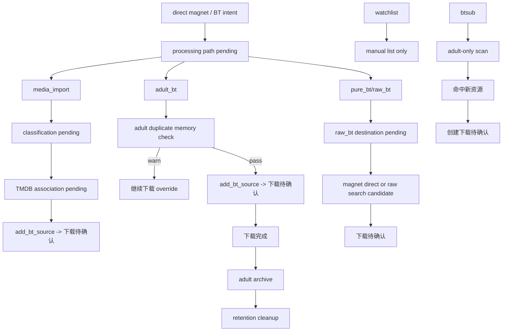

# BT, Adult, Subscription, Background Loops

> 主要依据：`app/bot/private_chat_bt_*`、`app/bot/bt_*_runtime.py`、`app/services/adult_duplicate_memory.py`、`app/services/adult_archive_service.py`、`app/services/manage_watchlist.py`、`app/services/manage_bt_subscription.py`、`app/bot/download_follow_up_runtime.py`

## 1. direct BT 入口

direct BT intent 由 `query_text_runtime.is_bt_direct_intent()` 识别：

- 原始 `magnet:?`
- 明确“下载这个 BT / 下载这个磁力”
- 某些 pure BT 查询文本

一旦命中，runtime 会：

1. 清掉旧的 BT follow-up pending
2. 把当前 source 写成 `bt_processing_path pending`
3. 回复处理链选择提示

## 2. 处理链分叉

### 2.1 当前提示文案

默认提示主要展示两条：

- `观影 PT 链`
- `BT 成人链`

### 2.2 但代码实际还接受第三条 pure BT 分支

`query_text_runtime.py` 和 `private_chat_bt_processing_runtime.py` 仍接受：

- `pure_bt`
- `pure-bt`
- `纯bt`
- `raw_bt`
- `raw`

也就是说：

- **用户可见提示主要强调 PT / 成人两条主线**
- **runtime 实际仍保留 pure BT / raw BT 的 follow-up 接口**

这是当前代码与文案之间一个很重要的真实细节。

## 3. 观影 PT 链分支

### 3.1 第一步：媒体类型选择

进入 `media_import` 后：

- 若没有显式 media kind
- 写 `bt_classification pending`
- 提示用户选 `movie / series / anime`

### 3.2 第二步：TMDB 关联

拿到 media kind 后：

- 写 `bt_tmdb_association pending`
- 提示用户发送片名，可带年份

TMDB 关联查询规则：

- 没有结果 -> 要求补更准标题
- 没有年份且候选多个 -> 判定为 ambiguous
- 成功 -> 生成标准化标题，再转成下载待确认

### 3.3 这一步不会自动 confirm

BT 媒体导入链最后调用的是 `add_bt_source(...)`，不是 `add_by_selection_with_auto_confirm(...)`。

因此 direct magnet 的媒体导入分支通常会得到：

- TMDB 关联成功文本
- 下载待确认文本

然后等用户显式 `confirm`。

## 4. 成人 BT 分支

`adult_bt` 分支会直接：

1. 解析 magnet 显示名
2. 绑定 BT 下载器执行配置
3. 调 `add_bt_source(...)`
4. `auto_import_enabled=False`

### 4.1 adult duplicate memory gate

真正写 pending add 前，`AddToDownloaderService._persist_pending_add()` 会：

- 调 `AdultDuplicateMemoryService.inspect()`
- 扫本地成人目录
- 查 `adult_content_registry`
- 必要时再查旧 `job_event`

如果命中或扫描降级：

- 不直接创建下载
- 先写 `bt_pending_state` 的 duplicate override
- 要求用户发送 `继续下载 ...`

用户回这句后，runtime 再调 `continue_duplicate_add()` 继续落 pending approval。

### 4.2 成人完成后的后半段

成人下载完成后不会走普通媒体导入，而是：

1. `PostDownloadAutoImportService` 发现该任务存在 adult registry record
2. 转 `AdultArchiveService.run_for_record()`
3. 当前状态为 `pending/downloading` -> 归档到目标目录
4. 当前状态为 `archived_present` 且保留期已到 -> 删除下载源并标记 `archived_deleted`

## 5. pure BT / raw BT 分支

进入 `pure_bt` 后：

1. 写 `raw_bt_destination pending`
2. 提示用户选择预设目标目录

然后分两种情况：

### 情况 A：source 本身就是 magnet

- 直接按所选目录创建下载待确认
- `auto_import_enabled=False`

### 情况 B：source 是 BT 搜索语句

- 用 `SearchMediaService.search_raw_candidates()` 搜 raw candidates
- 用 `pick_single_item_candidate()` 选一个最小命中
- 再创建下载待确认

pure BT 最终不会进 TMDB / metadata / subtitle / refresh 链。

## 6. `watchlist` 的真实边界

`ManageWatchlistService` 只支持：

- `list`
- `add`
- `remove`
- `clear`
- `sync`

但 `sync` 当前固定返回：

`想看清单当前只服务 PT 主线，不再同步到 BT 订阅。`

所以 watchlist 现在是纯持久化清单，不向 BT 侧桥接。

## 7. `btsub` 的真实边界

### 7.1 命令层

支持：

- `list`
- `add`
- `remove`
- `clear`
- `run`

### 7.2 添加边界

`_add_text()` 只接受 adult-only 订阅请求；否则返回 `BT_SUBSCRIPTION_ADULT_ONLY_TEXT`。

### 7.3 扫描边界

`_run_for_item()` 会先检查：

- `item.media_kind != "adult"` -> 记 out-of-scope warning，跳过扫描

只有成人条目才会继续：

1. 搜索候选
2. 选出一个新资源
3. 调 `AddToDownloaderService.add_candidate_source(...)`
4. 更新 `last_seen_source / last_seen_title`

### 7.4 `btsub` 不自动 confirm

如果创建 pending 成功，回复里仍是“下载待确认”文本。

也就是：

- `btsub` 可以自动发现资源
- 但不会自动跨过 downloader approval 边界

## 8. 后台循环

### 8.1 post-download auto-import scheduler

周期调用 `PostDownloadAutoImportService.run_once()`：

- 找已完成且待推进的 `download_monitor`
- 推导 auto import / adult archive
- 有通知时用 shared private-chat sender 主动发消息

### 8.2 download completion polling

周期做两类事：

- 轮询尚未完成的下载状态
- 对已经完成但仍绑定 Telegram progress 卡片的任务继续编辑状态卡，直到最终完成

### 8.3 BT subscription scheduler

周期调用 `ManageBtSubscriptionService.run_scheduler_tick()`：

- 遍历有订阅的 chat
- 扫描命中新资源
- 有结果时主动发送通知

这一轮执行也会经过 `ExecutionGate.run(ACTION_BT_SUBSCRIPTION_RUN, ...)`。

## 9. 后台主动通知的渠道差异

shared sender 当前可稳定主动发送：

- Telegram
- Feishu
- personal WeChat

WeCom 入站能走主链，但主动发送目前在 shared sender 中仍是 unsupported。

这意味着某些后台提示在 WeCom-only 宿主里更像“内部任务继续推进，但通知能力受限”。

## 10. BT 支线总图

