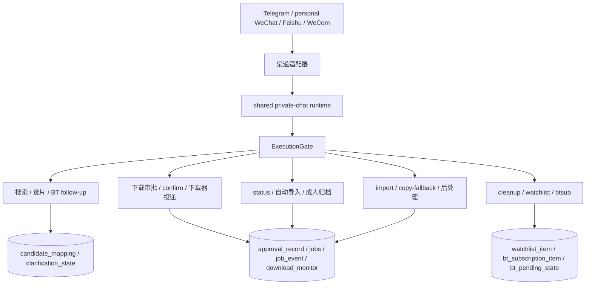

# Luminarr Flows Index

> 本目录基于 `2026-05-07` 仓库真实代码反写，描述“系统现在如何工作”。
> 如果文档与代码冲突，以代码为准。

## 目的

这组文档不重新定义产品，也不替代 `docs/PRD.md` / `docs/ARCHITECTURE.md`。
它只回答一件事：

**一条请求从哪个入口进入、经过哪些路由和状态表、在哪个节点触发副作用、最后如何落盘和恢复。**

## 阅读顺序

1. [01-system-startup-and-hosts.md](./01-system-startup-and-hosts.md)
   看应用如何启动、如何装配 repo/client/service、如何决定 Telegram / 非 Telegram 宿主。
2. [02-private-chat-mainline.md](./02-private-chat-mainline.md)
   看四个私聊入口如何统一投影到 shared runtime，以及搜索/选片/确认的主链路。
3. [03-download-import-cleanup.md](./03-download-import-cleanup.md)
   看下载审批、状态查询、自动导入、copy-fallback、cleanup guardrail。
4. [04-bt-adult-subscription-and-background.md](./04-bt-adult-subscription-and-background.md)
   看 direct BT、adult BT、pure BT、watchlist、`btsub` 和后台轮询。
5. [05-state-and-event-ledger.md](./05-state-and-event-ledger.md)
   看 SQLite 真相层、`jobs` / `approval_record` / `job_event` / `download_monitor` 的分工。

## 全局不变量

- 入口统一是“私聊文本”，不是 Web API。
- 副作用默认走审批或串行化，不让自然语言直接改外部系统。
- SQLite 是跨请求恢复和审计的主真相源。
- `ExecutionGate` 允许只读动作并发，副作用动作串行。
- Telegram、personal WeChat、Feishu、WeCom 共用同一套 shared private-chat runtime。
- 后台任务不是独立 worker，而是 sidecar / scheduler 挂在当前宿主生命周期上。

## 代码主地图

| 主题 | 主要代码入口 |
| --- | --- |
| 启动装配 | `app/main.py` |
| Telegram 入口 | `app/bot/telegram_runtime_adapter.py` |
| 非 Telegram 渠道入口 | `app/bot/feishu_adapter.py`、`app/bot/personal_wechat_text.py`、`app/bot/wecom_adapter.py` |
| 统一路由 | `app/bot/private_chat_runtime.py` |
| 搜索与候选 | `app/services/search_media.py` |
| 下载审批与投递 | `app/services/add_to_downloader.py`、`app/services/add_pending_context.py` |
| 状态与自动导入 | `app/services/get_download_status.py`、`app/services/post_download_auto_import.py` |
| 导入与后处理 | `app/services/import_to_library.py`、`app/services/import_transfer_execution.py`、`app/services/import_post_processing.py` |
| Cleanup | `app/services/cleanup_downloaded_source.py` |
| BT 分支与订阅 | `app/bot/private_chat_bt_*`、`app/services/manage_bt_subscription.py` |
| 真相层 | `app/db/*.py`、`app/db/sqlite.py` |

## 端到端总览

## 使用建议

- 想理解“为什么这条命令会被这样路由”：先看 `02-private-chat-mainline.md`
- 想理解“为什么这里必须 confirm / 为什么会 stale”：先看 `03-download-import-cleanup.md` 和 `05-state-and-event-ledger.md`
- 想理解“adult BT 为什么和普通导入链不同”：先看 `04-bt-adult-subscription-and-background.md`
- 想理解“为什么重启后还能接着跑”：先看 `05-state-and-event-ledger.md`
